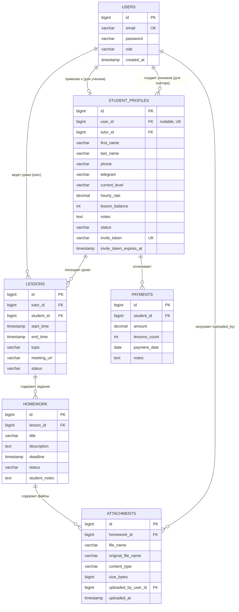
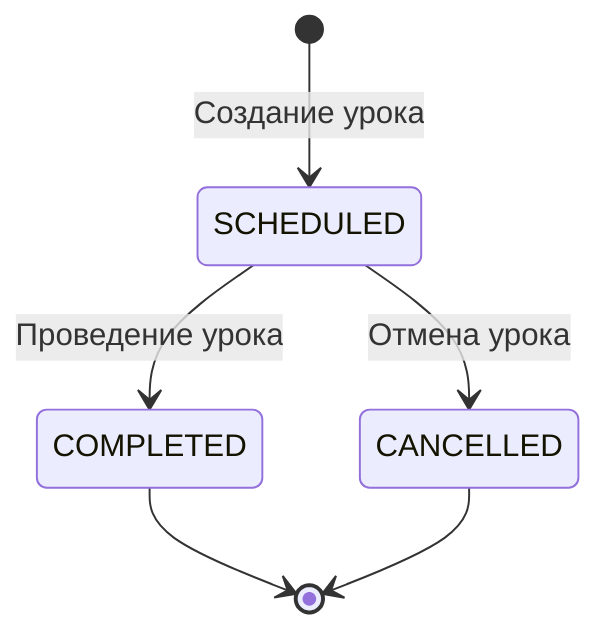
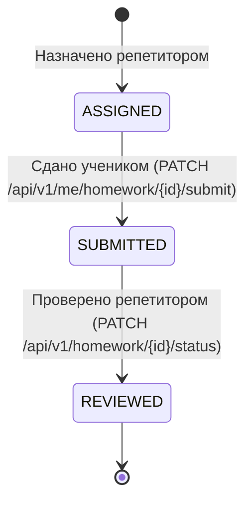

# 🎓 CRM for Tutor (CrmForTutor)

[](https://openjdk.org/)
[](https://spring.io/projects/spring-boot)
[](https://www.postgresql.org/)
[](https://www.liquibase.org/)
[-yellow?logo=jsonwebtokens)](https://jwt.io/)
[](https://swagger.io/)
[](https://junit.org/junit5/)

**CRM for Tutor** — специализированная серверная платформа для автоматизации работы частных преподавателей, репетиторов и онлайн-школ. Система предоставляет раздельные рабочие пространства для репетитора и ученика: управление расписанием, балансом уроков, взаиморасчетами, домашними заданиями и файловыми вложениями с контролем доступа и строгой изоляцией данных.

---

## 📑 Содержание

- [✨ Ключевые возможности](#-ключевые-возможности)
- [🏛 Архитектура и модель данных](#-архитектура-и-модель-данных)
- [🔒 Безопасность и ролевая модель](#-безопасность-и-ролевая-модель)
- [🔄 Жизненные циклы и бизнес-логика](#-жизненные-циклы-и-бизнес-логика)
- [📁 Инфраструктура файлов](#-инфраструктура-файлов)
- [🚀 Справочник API](#-справочник-api)
- [🛠 Технологический стек](#-технологический-стек)
- [⚡ Запуск и конфигурация](#-запуск-и-конфигурация)
- [🧪 Тестирование](#-тестирование)
- [🗺 Планы развития](#-планы-развития)

---

## ✨ Ключевые возможности

- 👩‍🏫 **Кабинет репетитора (`ROLE_TUTOR`)**:
  - Карточки учеников, ставки за час, история контактов и приватные заметки.
  - Генерация безопасных одноразовых инвайт-токенов для приглашения учеников.
  - Календарное планирование уроков с интервальной фильтрацией, темами и ссылками на видеозвонки.
  - Учет оплат с автоматическим пересчетом оплаченного баланса занятий (включая дельту при редактировании и откаты при удалении).
  - Назначение домашних заданий и рецензирование сданных работ (`SUBMITTED → REVIEWED`).
  - Финансовая аналитика доходов по месяцам и годам.

- 👨‍🎓 **Личный кабинет ученика (`ROLE_STUDENT`)**:
  - Регистрация по выданному репетитором инвайт-токену без открытого публичного доступа.
  - Просмотр расписания собственных уроков.
  - Просмотр домашней работы, статусов и дедлайнов.
  - Сдача ДЗ (`ASSIGNED → SUBMITTED`) с прикреплением текстового ответа, ссылок и файлов.
  - Прозрачный просмотр своего баланса занятий и истории внесенных платежей.
  - Полная изоляция от внутренних данных репетитора (заметки, финансовые настройки).

- 📎 **Работа с файлами и вложениями**:
  - Загрузка материалов к ДЗ как репетитором, так и учеником.
  - Валидация типов файлов по белому списку и ограничение размера.
  - Безопасное скачивание с защитой от Path Traversal и проверкой владения уроком.
  - Контроль удаления файлов (автор загрузки либо репетитор-владелец).

---

## 🏛 Архитектура и модель данных



---

## 🔒 Безопасность и ролевая модель

В приложении включена декларативная безопасность методов Spring Security (`@EnableMethodSecurity`):

| Роль | Область ответственности | Права доступа |
| :--- | :--- | :--- |
| **`ROLE_TUTOR`** | Репетитор / Преподаватель | Полный доступ к модулям `/api/v1/students/**`, `/api/v1/lessons/**`, `/api/v1/payments/**`, `/api/v1/homework/**`. Запрещен доступ к `/api/v1/me/**`. |
| **`ROLE_STUDENT`** | Ученик | Доступ строго к эндпоинтам личного кабинета `/api/v1/me/**`. Изоляция данных исключительно по `StudentProfile.id` авторизованного ученика. |
| **Оба (`TUTOR`, `STUDENT`)** | Участники урока | Эндпоинты вложений `/api/v1/homework/{id}/attachments` и скачивания `/api/v1/attachments/{id}/download` с программной валидацией владения уроком. |
| **Публичные** | Неавторизованные пользователи | Аутентификация (`/api/v1/auth/login`, `/api/v1/auth/register`, `/api/v1/auth/refresh`, `/api/v1/auth/register-student`), Swagger UI. |

### Провайдеры контекста
- [`CurrentUserProvider`](src/main/java/org/akusher/crmfortutor/security/CurrentUserProvider.java): извлекает ID текущего пользователя из JWT `SecurityContextHolder`.
- [`CurrentStudentProvider`](src/main/java/org/akusher/crmfortutor/security/CurrentStudentProvider.java): резолвит профиль `StudentProfile` текущего пользователя (`User.id == StudentProfile.userId`). Если профиль не привязан — выбрасывается `403 Forbidden`.

---

## 🔄 Жизненные циклы и бизнес-логика

### 1. Жизненный цикл урока (`LessonStatus`)

> Отмененный урок (`CANCELLED`) нельзя завершить (`COMPLETED`).

### 2. Жизненный цикл домашнего задания (`HomeworkStatus`)

> **Правило переходов:**
> - Ученик может перевести статус только `ASSIGNED → SUBMITTED`.
> - Репетитор может перевести статус только `SUBMITTED → REVIEWED` (репетитор не может «сдать» за ученика, а ученик не может сам себе проставить «проверено»).

### 3. Автоматический пересчет баланса занятий (`lessonBalance`)
Все манипуляции с платежами выполняются атомарно внутри транзакции (`@Transactional`):
- **Создание платежа**: к `StudentProfile.lessonBalance` прибавляется `lessonsCount`.
- **Редактирование платежа**: баланс корректируется на точную дельту `(newLessonsCount - oldLessonsCount)`.
- **Удаление платежа**: из баланса вычитается ранее начисленное количество занятий `lessonsCount`.

---

## 📁 Инфраструктура файлов

Хранение файлов организовано через интерфейс [`FileStorageService`](src/main/java/org/akusher/crmfortutor/service/FileStorageService.java) и реализацию [`LocalFileStorageService`](src/main/java/org/akusher/crmfortutor/service/LocalFileStorageService.java):

- **Хранилище на диске**: директория настраивается через `storage.upload-dir` (по умолчанию `./uploads`).
- **Уникальные имена**: генерируются в формате `UUID + .ext`.
- **Белый список расширений**: `pdf`, `jpg`, `jpeg`, `png`, `doc`, `docx`, `zip` (несоответствие вызывает `400 Bad Request`).
- **Лимит размера**: настраивается через `storage.max-file-size` и `spring.servlet.multipart.max-file-size` (по умолчанию `10MB`).
- **Безопасность путей**: пресечение попыток Path Traversal (`../`).
- **Заголовки скачивания**: корректное формирование `Content-Disposition: attachment; filename="..."; filename*=UTF-8''...` с поддержкой не-ASCII символов.

---

## 🚀 Справочник API

Базовый префикс всех эндпоинтов: `/api/v1`

### 🔑 Аутентификация (`/api/v1/auth`)

| Метод | Путь | Роль | Описание |
| :--- | :--- | :--- | :--- |
| `POST` | `/api/v1/auth/register` | Public | Регистрация репетитора (`ROLE_TUTOR`) |
| `POST` | `/api/v1/auth/login` | Public | Авторизация (получение access и refresh токенов) |
| `POST` | `/api/v1/auth/refresh` | Public | Обновление пары JWT-токенов |
| `POST` | `/api/v1/auth/register-student` | Public | Регистрация аккаунта ученика по инвайт-токену |

### 👨‍🏫 Управление учениками (`/api/v1/students`)

| Метод | Путь | Роль | Описание |
| :--- | :--- | :--- | :--- |
| `POST` | `/api/v1/students` | `TUTOR` | Создание карточки ученика |
| `GET` | `/api/v1/students` | `TUTOR` | Список всех учеников текущего репетитора |
| `GET` | `/api/v1/students/{id}` | `TUTOR` | Профиль ученика по ID |
| `PUT` | `/api/v1/students/{id}` | `TUTOR` | Обновление данных ученика |
| `DELETE` | `/api/v1/students/{id}` | `TUTOR` | Удаление карточки ученика |
| `POST` | `/api/v1/students/{id}/invite` | `TUTOR` | Генерация одноразового инвайт-токена (срок 7 дней) |

### 📅 Уроки и расписание (`/api/v1/lessons`)

| Метод | Путь | Роль | Описание |
| :--- | :--- | :--- | :--- |
| `POST` | `/api/v1/lessons` | `TUTOR` | Планирование нового урока |
| `GET` | `/api/v1/lessons?from=...&to=...` | `TUTOR` | Получение уроков за временной интервал |
| `GET` | `/api/v1/lessons/{id}` | `TUTOR` | Получение урока по ID |
| `PUT` | `/api/v1/lessons/{id}` | `TUTOR` | Редактирование времени, темы и ссылки на звонок |
| `PATCH` | `/api/v1/lessons/{id}/status` | `TUTOR` | Смена статуса (`SCHEDULED`, `COMPLETED`, `CANCELLED`) |
| `DELETE` | `/api/v1/lessons/{id}` | `TUTOR` | Удаление урока |

### 💳 Оплаты и баланс (`/api/v1/payments`)

| Метод | Путь | Роль | Описание |
| :--- | :--- | :--- | :--- |
| `POST` | `/api/v1/payments` | `TUTOR` | Проведение оплаты (начисление уроков на баланс) |
| `GET` | `/api/v1/payments/student/{studentId}` | `TUTOR` | История оплат конкретного ученика |
| `GET` | `/api/v1/payments/analytics?year=...&month=...` | `TUTOR` | Финансовая статистика за месяц/год |
| `PUT` | `/api/v1/payments/{id}` | `TUTOR` | Корректировка оплаты с пересчетом дельты баланса |
| `DELETE` | `/api/v1/payments/{id}` | `TUTOR` | Удаление оплаты с откатом начисленных занятий |

### 📝 Домашние задания (`/api/v1/homework`)

| Метод | Путь | Роль | Описание |
| :--- | :--- | :--- | :--- |
| `POST` | `/api/v1/homework` | `TUTOR` | Создание домашнего задания к уроку |
| `GET` | `/api/v1/homework/student/{studentId}` | `TUTOR` | Список заданий конкретного ученика |
| `GET` | `/api/v1/homework/{id}` | `TUTOR` | Получение задания по ID |
| `PATCH` | `/api/v1/homework/{id}/status` | `TUTOR` | Проверка задания (`SUBMITTED → REVIEWED`) |

### 🎒 Личный кабинет ученика (`/api/v1/me`)

| Метод | Путь | Роль | Описание |
| :--- | :--- | :--- | :--- |
| `GET` | `/api/v1/me/profile` | `STUDENT` | Своя карточка (без приватных заметок репетитора) |
| `GET` | `/api/v1/me/lessons?from=...&to=...` | `STUDENT` | Расписание собственных занятий |
| `GET` | `/api/v1/me/homework` | `STUDENT` | Список своих заданий со статусами и дедлайнами |
| `GET` | `/api/v1/me/payments` | `STUDENT` | История оплат и актуальный баланс оплаченных занятий |
| `PATCH` | `/api/v1/me/homework/{id}/submit` | `STUDENT` | Сдача задания (`ASSIGNED → SUBMITTED`) с ответом |

### 📎 Вложения и файлы

| Метод | Путь | Роль | Описание |
| :--- | :--- | :--- | :--- |
| `POST` | `/api/v1/homework/{id}/attachments` | `TUTOR`, `STUDENT` | Загрузка файла к ДЗ (`multipart/form-data`) |
| `GET` | `/api/v1/homework/{id}/attachments` | `TUTOR`, `STUDENT` | Метаданные вложений для участников задания |
| `GET` | `/api/v1/attachments/{id}/download` | `TUTOR`, `STUDENT` | Скачивание файла с проверкой доступа |
| `DELETE` | `/api/v1/attachments/{id}` | `TUTOR`, `STUDENT` | Удаление файла (автор загрузки либо тьютор урока) |

---

## 🛠 Технологический стек

- **Язык программирования**: Java 21 LTS
- **Фреймворк**: Spring Boot 4.1.1 (Spring Framework, Spring Security, Spring Data JPA, Spring Web)
- **База данных**: PostgreSQL (production/runtime), H2 In-Memory (unit & integration tests)
- **Миграции БД**: Liquibase (XML changelogs)
- **Аутентификация**: JJWT (`io.jsonwebtoken:0.12.6`), HMAC-SHA, Stateless JWT sessions
- **Генерация кода и маппинг**: Lombok, MapStruct 1.6.3
- **Документация**: SpringDoc OpenAPI 2.8.5 (Swagger UI)
- **Тестирование**: JUnit 5, Mockito, AssertJ, Spring Security Test, Spring Test MockMvc

---

## ⚡ Запуск и конфигурация

### Требования
- JDK 21+
- Maven 3.9+ (или комплектный `./mvnw`)
- PostgreSQL 15+ (или Docker)

### 1. Настройка окружения
Параметры по умолчанию заданы в [`application.yml`](src/main/resources/application.yml) и могут переопределяться переменными окружения:

```env
DB_URL=jdbc:postgresql://localhost:5432/crm_for_tutor
DB_USERNAME=postgres
DB_PASSWORD=your_password
SERVER_PORT=8081
JWT_SECRET=404E635266556A586E3272357538782F413F4428472B4B6250645367566B5970
JWT_ACCESS_EXPIRATION=900000
JWT_REFRESH_EXPIRATION=604800000
STORAGE_UPLOAD_DIR=./uploads
STORAGE_MAX_FILE_SIZE=10MB
```

### 2. Запуск базы данных в Docker (опционально)
```bash
docker run --name crm-postgres -e POSTGRES_DB=crm_for_tutor -e POSTGRES_USER=postgres -e POSTGRES_PASSWORD=tutor2026 -p 5455:5432 -d postgres:16-alpine
```

### 3. Сборка и запуск приложения
```bash
# Сборка проекта
./mvnw clean package

# Запуск приложения
./mvnw spring-boot:run
```

После запуска:
- Сервер доступен по адресу: `http://localhost:8081`
- Swagger UI документация: `http://localhost:8081/swagger-ui.html`
- OpenAPI спецификация: `http://localhost:8081/v3/api-docs`

---

## 🧪 Тестирование

Проект содержит модульные и интеграционные тесты, покрывающие контроллеры, сервисы, проверки безопасности и права доступа.

```bash
# Запуск всех тестов
./mvnw test
```

### Структура тестов:
- **Unit-тесты сервисов**: тестирование бизнес-правил, пересчета баланса уроков, переходов статусов ДЗ и валидации файлов на изолированных mock-объектах.
- **Unit-тесты контроллеров**: тестирование валидации входящих DTO, HTTP-статусов и сериализации JSON через `MockMvc standaloneSetup`.
- **Интеграционные тесты безопасности ([`MethodSecurityIntegrationTest`](src/test/java/org/akusher/crmfortutor/security/MethodSecurityIntegrationTest.java))**: проверка работы Spring Method Security (`@PreAuthorize`), запрет взаимного проникновения между ролями `TUTOR` и `STUDENT` (HTTP 403 Forbidden).

---

## 🗺 Планы развития

- [ ] Интеграция с Telegram Bot для уведомлений о новых занятиях и сдаче заданий.
- [ ] Синхронизация расписания с Google Calendar / Yandex Calendar (iCal).
- [ ] Аутентификация через OAuth2 / Google Sign-In.
- [ ] Подключение облачного хранилища S3 (MinIO / AWS S3 / Yandex Object Storage) через реализацию `FileStorageService`.
- [ ] Webhook-интеграция с эквайрингами (ЮKassa / Tinkoff) для автоматического подтверждения платежей.
- [ ] Поддержка групповых занятий (несколько учеников на один урок).
