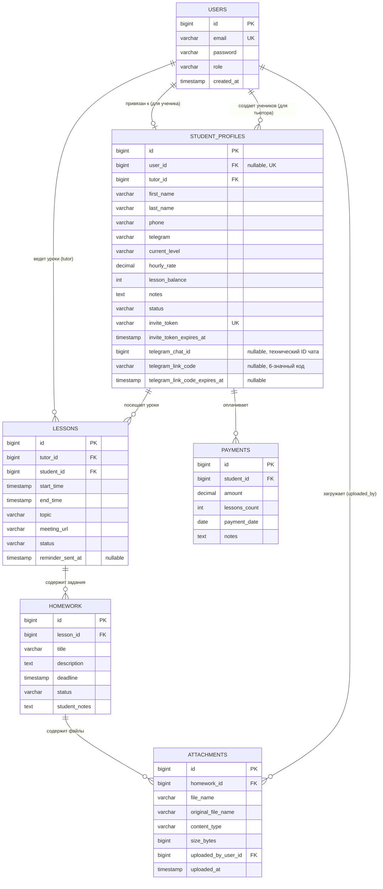
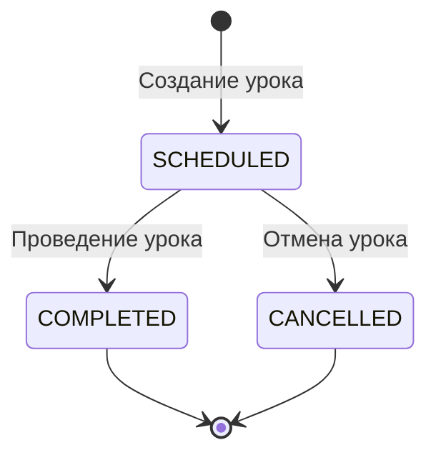
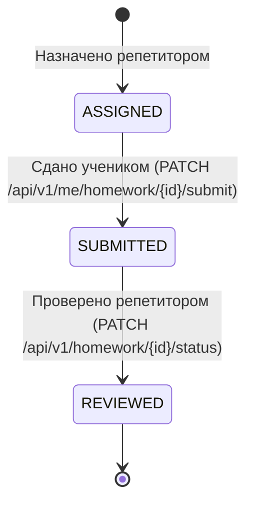

# 🎓 CRM for Tutor (CrmForTutor)

[](https://openjdk.org/)
[](https://spring.io/projects/spring-boot)
[](https://www.postgresql.org/)
[](https://www.liquibase.org/)
[-yellow?logo=jsonwebtokens)](https://jwt.io/)
[](https://swagger.io/)
[](https://junit.org/junit5/)

**CRM for Tutor** — специализированная серверная платформа для автоматизации работы частных преподавателей, репетиторов и онлайн-школ. Система предоставляет раздельные рабочие пространства для репетитора и ученика: управление расписанием, балансом уроков, взаиморасчетами, домашними заданиями и файловыми вложениями с контролем доступа и строгой изоляцией данных.

---

## 📑 Содержание

- [✨ Ключевые возможности](#-ключевые-возможности)
- [🏛 Архитектура и модель данных](#-архитектура-и-модель-данных)
- [🔒 Безопасность и ролевая модель](#-безопасность-и-ролевая-модель)
- [🔄 Жизненные циклы и бизнес-логика](#-жизненные-циклы-и-бизнес-логика)
- [📁 Инфраструктура файлов](#-инфраструктура-файлов)
- [🚀 Справочник API](#-справочник-api)
- [🤖 Интеграция с Telegram Bot API](#-интеграция-с-telegram-bot-api)
- [🛠 Технологический стек](#-технологический-стек)
- [⚡ Запуск и конфигурация](#-запуск-и-конфигурация)
- [🚢 Развертывание и Docker (Production)](#-развертывание-и-docker-production)
- [🧪 Тестирование](#-тестирование)
- [🗺 Планы развития](#-планы-развития)

---

## ✨ Ключевые возможности

- 👩‍🏫 **Кабинет репетитора (`ROLE_TUTOR`)**:
  - Карточки учеников, ставки за час, история контактов и приватные заметки.
  - Генерация безопасных одноразовых инвайт-токенов для приглашения учеников.
  - Календарное планирование уроков с интервальной фильтрацией, темами и ссылками на видеозвонки.
  - Учет оплат с автоматическим пересчетом оплаченного баланса занятий (включая дельту при редактировании и откаты при удалении).
  - Назначение домашних заданий и рецензирование сданных работ (`SUBMITTED → REVIEWED`).
  - Финансовая аналитика доходов по месяцам и годам.

- 👨‍🎓 **Личный кабинет ученика (`ROLE_STUDENT`)**:
  - Регистрация по выданному репетитором инвайт-токену без открытого публичного доступа.
  - Просмотр расписания собственных уроков.
  - Просмотр домашней работы, статусов и дедлайнов.
  - Сдача ДЗ (`ASSIGNED → SUBMITTED`) с прикреплением текстового ответа, ссылок и файлов.
  - Прозрачный просмотр своего баланса занятий и истории внесенных платежей.
  - Полная изоляция от внутренних данных репетитора (заметки, финансовые настройки).

- 📎 **Работа с файлами и вложениями**:
  - Загрузка материалов к ДЗ как репетитором, так и учеником.
  - Валидация типов файлов по белому списку и ограничение размера.
  - Безопасное скачивание с защитой от Path Traversal и проверкой владения уроком.
  - Контроль удаления файлов (автор загрузки либо репетитор-владелец).

---

## 🏛 Архитектура и модель данных



---

## 🔒 Безопасность и ролевая модель

В приложении включена декларативная безопасность методов Spring Security (`@EnableMethodSecurity`):

| Роль | Область ответственности | Права доступа |
| :--- | :--- | :--- |
| **`ROLE_TUTOR`** | Репетитор / Преподаватель | Полный доступ к модулям `/api/v1/students/**`, `/api/v1/lessons/**`, `/api/v1/payments/**`, `/api/v1/homework/**`. Запрещен доступ к `/api/v1/me/**`. |
| **`ROLE_STUDENT`** | Ученик | Доступ строго к эндпоинтам личного кабинета `/api/v1/me/**`. Изоляция данных исключительно по `StudentProfile.id` авторизованного ученика. |
| **Оба (`TUTOR`, `STUDENT`)** | Участники урока | Эндпоинты вложений `/api/v1/homework/{id}/attachments` и скачивания `/api/v1/attachments/{id}/download` с программной валидацией владения уроком. |
| **Публичные** | Неавторизованные пользователи | Аутентификация (`/api/v1/auth/login`, `/api/v1/auth/register`, `/api/v1/auth/refresh`, `/api/v1/auth/register-student`), Swagger UI. |

### Провайдеры контекста
- [`CurrentUserProvider`](src/main/java/org/akusher/crmfortutor/security/CurrentUserProvider.java): извлекает ID текущего пользователя из JWT `SecurityContextHolder`.
- [`CurrentStudentProvider`](src/main/java/org/akusher/crmfortutor/security/CurrentStudentProvider.java): резолвит профиль `StudentProfile` текущего пользователя (`User.id == StudentProfile.userId`). Если профиль не привязан — выбрасывается `403 Forbidden`.

---

## 🔄 Жизненные циклы и бизнес-логика

### 1. Жизненный цикл урока (`LessonStatus`)

> Отмененный урок (`CANCELLED`) нельзя завершить (`COMPLETED`).

### 2. Жизненный цикл домашнего задания (`HomeworkStatus`)

> **Правило переходов:**
> - Ученик может перевести статус только `ASSIGNED → SUBMITTED`.
> - Репетитор может перевести статус только `SUBMITTED → REVIEWED` (репетитор не может «сдать» за ученика, а ученик не может сам себе проставить «проверено»).

### 3. Автоматический пересчет баланса занятий (`lessonBalance`)
Все манипуляции с платежами выполняются атомарно внутри транзакции (`@Transactional`):
- **Создание платежа**: к `StudentProfile.lessonBalance` прибавляется `lessonsCount`.
- **Редактирование платежа**: баланс корректируется на точную дельту `(newLessonsCount - oldLessonsCount)`.
- **Удаление платежа**: из баланса вычитается ранее начисленное количество занятий `lessonsCount`.

---

## 📁 Инфраструктура файлов

Хранение файлов организовано через интерфейс [`FileStorageService`](src/main/java/org/akusher/crmfortutor/service/FileStorageService.java) и реализацию [`LocalFileStorageService`](src/main/java/org/akusher/crmfortutor/service/LocalFileStorageService.java):

- **Хранилище на диске**: директория настраивается через `storage.upload-dir` (по умолчанию `./uploads`).
- **Уникальные имена**: генерируются в формате `UUID + .ext`.
- **Белый список расширений**: `pdf`, `jpg`, `jpeg`, `png`, `doc`, `docx`, `zip` (несоответствие вызывает `400 Bad Request`).
- **Лимит размера**: настраивается через `storage.max-file-size` и `spring.servlet.multipart.max-file-size` (по умолчанию `10MB`).
- **Безопасность путей**: пресечение попыток Path Traversal (`../`).
- **Заголовки скачивания**: корректное формирование `Content-Disposition: attachment; filename="..."; filename*=UTF-8''...` с поддержкой не-ASCII символов.

---

## 🚀 Справочник API

Базовый префикс всех эндпоинтов: `/api/v1`

### 🔑 Аутентификация (`/api/v1/auth`)

| Метод | Путь | Роль | Описание |
| :--- | :--- | :--- | :--- |
| `POST` | `/api/v1/auth/register` | Public | Регистрация репетитора (`ROLE_TUTOR`) |
| `POST` | `/api/v1/auth/login` | Public | Авторизация (получение access и refresh токенов) |
| `POST` | `/api/v1/auth/refresh` | Public | Обновление пары JWT-токенов |
| `POST` | `/api/v1/auth/register-student` | Public | Регистрация аккаунта ученика по инвайт-токену |

### 👨‍🏫 Управление учениками (`/api/v1/students`)

| Метод | Путь | Роль | Описание |
| :--- | :--- | :--- | :--- |
| `POST` | `/api/v1/students` | `TUTOR` | Создание карточки ученика |
| `GET` | `/api/v1/students` | `TUTOR` | Список всех учеников текущего репетитора |
| `GET` | `/api/v1/students/{id}` | `TUTOR` | Профиль ученика по ID |
| `PUT` | `/api/v1/students/{id}` | `TUTOR` | Обновление данных ученика |
| `DELETE` | `/api/v1/students/{id}` | `TUTOR` | Удаление карточки ученика |
| `POST` | `/api/v1/students/{id}/invite` | `TUTOR` | Генерация одноразового инвайт-токена (срок 7 дней) |
| `POST` | `/api/v1/students/{id}/telegram-link-code` | `TUTOR` | Генерация 6-значного кода привязки Telegram (срок 15 минут) |

> **Безопасность привязки аккаунта**: Репетитор не может вручную привязать произвольный аккаунт пользователя (`User`) к карточке ученика через `userId`. Единственный способ связать `StudentProfile` с учетной записью пользователя — безопасный инвайт-флоу: генерация одноразового токена приглашения (`POST /api/v1/students/{id}/invite`) и последующая регистрация ученика (`POST /api/v1/auth/register-student`).

### 🤖 Telegram Webhook (`/api/v1/telegram`)

| Метод | Путь | Роль | Описание |
| :--- | :--- | :--- | :--- |
| `POST` | `/api/v1/telegram/webhook` | Public | Прием webhook-апдейтов от Telegram Bot API и привязка чата ученика |

### 📅 Уроки и расписание (`/api/v1/lessons`)

| Метод | Путь | Роль | Описание |
| :--- | :--- | :--- | :--- |
| `POST` | `/api/v1/lessons` | `TUTOR` | Планирование нового урока |
| `GET` | `/api/v1/lessons?from=...&to=...` | `TUTOR` | Получение уроков за временной интервал |
| `GET` | `/api/v1/lessons/{id}` | `TUTOR` | Получение урока по ID |
| `PUT` | `/api/v1/lessons/{id}` | `TUTOR` | Редактирование времени, темы и ссылки на звонок |
| `PATCH` | `/api/v1/lessons/{id}/status` | `TUTOR` | Смена статуса (`SCHEDULED`, `COMPLETED`, `CANCELLED`) |
| `DELETE` | `/api/v1/lessons/{id}` | `TUTOR` | Удаление урока |

### 💳 Оплаты и баланс (`/api/v1/payments`)

| Метод | Путь | Роль | Описание |
| :--- | :--- | :--- | :--- |
| `POST` | `/api/v1/payments` | `TUTOR` | Проведение оплаты (начисление уроков на баланс) |
| `GET` | `/api/v1/payments/student/{studentId}` | `TUTOR` | История оплат конкретного ученика |
| `GET` | `/api/v1/payments/analytics?year=...&month=...` | `TUTOR` | Финансовая статистика за месяц/год |
| `PUT` | `/api/v1/payments/{id}` | `TUTOR` | Корректировка оплаты с пересчетом дельты баланса |
| `DELETE` | `/api/v1/payments/{id}` | `TUTOR` | Удаление оплаты с откатом начисленных занятий |

### 📝 Домашние задания (`/api/v1/homework`)

| Метод | Путь | Роль | Описание |
| :--- | :--- | :--- | :--- |
| `POST` | `/api/v1/homework` | `TUTOR` | Создание домашнего задания к уроку |
| `GET` | `/api/v1/homework/student/{studentId}` | `TUTOR` | Список заданий конкретного ученика |
| `GET` | `/api/v1/homework/{id}` | `TUTOR` | Получение задания по ID |
| `PATCH` | `/api/v1/homework/{id}/status` | `TUTOR` | Проверка задания (`SUBMITTED → REVIEWED`) |

### 🎒 Личный кабинет ученика (`/api/v1/me`)

| Метод | Путь | Роль | Описание |
| :--- | :--- | :--- | :--- |
| `GET` | `/api/v1/me/profile` | `STUDENT` | Своя карточка (без приватных заметок репетитора) |
| `GET` | `/api/v1/me/lessons?from=...&to=...` | `STUDENT` | Расписание собственных занятий |
| `GET` | `/api/v1/me/homework` | `STUDENT` | Список своих заданий со статусами и дедлайнами |
| `GET` | `/api/v1/me/payments` | `STUDENT` | История оплат и актуальный баланс оплаченных занятий |
| `PATCH` | `/api/v1/me/homework/{id}/submit` | `STUDENT` | Сдача задания (`ASSIGNED → SUBMITTED`) с ответом |

### 📎 Вложения и файлы

| Метод | Путь | Роль | Описание |
| :--- | :--- | :--- | :--- |
| `POST` | `/api/v1/homework/{id}/attachments` | `TUTOR`, `STUDENT` | Загрузка файла к ДЗ (`multipart/form-data`) |
| `GET` | `/api/v1/homework/{id}/attachments` | `TUTOR`, `STUDENT` | Метаданные вложений для участников задания |
| `GET` | `/api/v1/attachments/{id}/download` | `TUTOR`, `STUDENT` | Скачивание файла с проверкой доступа |
| `DELETE` | `/api/v1/attachments/{id}` | `TUTOR`, `STUDENT` | Удаление файла (автор загрузки либо тьютор урока) |

---

## 🤖 Интеграция с Telegram Bot API

Система поддерживает привязку Telegram-аккаунтов учеников к их профилям в CRM для последующей отправки сервисных уведомлений (напоминания об уроках, статусы домашних заданий, изменения баланса).

Поле `telegram` (username) в карточке ученика остается информационным (для справки), а технический `telegramChatId` сохраняется автоматически в результате связывания и используется для отправки сообщений через Telegram Bot API.

### 1. Создание бота в Telegram
1. Перейдите в Telegram к [@BotFather](https://t.me/BotFather).
2. Выполните команду `/newbot` и следуйте подсказкам (задайте отображаемое имя и уникальный username бота, оканчивающийся на `bot`, например `MyTutorCrmBot`).
3. Скопируйте полученный **HTTP API token**.

### 2. Конфигурация в приложении
Укажите полученные данные в переменных окружения или файле конфигурации:
```env
TELEGRAM_BOT_TOKEN=123456789:ABCDefGhIJKlmNoPQRsTUVwxyZ
TELEGRAM_BOT_USERNAME=MyTutorCrmBot
```

В `application.yml` эти параметры маппятся на:
```yaml
telegram:
  bot-token: ${TELEGRAM_BOT_TOKEN:}
  bot-username: ${TELEGRAM_BOT_USERNAME:}
  api-url: ${TELEGRAM_API_URL:https://api.telegram.org}
```

### 3. Сценарий привязки Telegram к профилю ученика
1. **Генерация кода**: Репетитор в карточке ученика запрашивает код привязки:
   ```http
   POST /api/v1/students/{id}/telegram-link-code
   Authorization: Bearer <TUTOR_ACCESS_TOKEN>
   ```
   Сервер генерирует случайный 6-значный цифровой код (время жизни — 15 минут) и сохраняет его в `StudentProfile`. В ответе возвращаются:
   ```json
   {
     "studentId": 10,
     "linkCode": "481923",
     "code": "481923",
     "expiresAt": "2026-09-20T12:35:00Z",
     "botUsername": "MyTutorCrmBot"
   }
   ```
2. **Передача кода ученику**: Репетитор сообщает 6-значный код ученику либо дает прямую ссылку вида `https://t.me/MyTutorCrmBot?start=481923`.
3. **Отправка кода боту**: Ученик нажимает `Start` в боте или отправляет сообщение с кодом `481923`.
4. **Обработка Webhook**: Telegram Bot API пересылает сообщение на эндпоинт приложения `POST /api/v1/telegram/webhook`:
   - Сервис валидирует код и срок его действия.
   - Записывает `chatId` в `student.telegramChatId`.
   - Очищает `telegramLinkCode` и `telegramLinkCodeExpiresAt`.
   - Отправляет ответное сообщение через Bot API (`sendMessage`): *"Telegram успешно привязан к вашему профилю ученика! Теперь вы будете получать уведомления."*

### 4. Настройка Webhook через Telegram Bot API (Production)
Telegram Bot API доставляет апдейты через вебхук **только на публичные HTTPS-адреса** с доверенным сертификатом.

После развертывания приложения на сервере зарегистрируйте URL вебхука:
```bash
curl -F "url=https://your-crm-domain.com/api/v1/telegram/webhook" \
     -F "secret_token=<TELEGRAM_WEBHOOK_SECRET>" \
     https://api.telegram.org/bot<TELEGRAM_BOT_TOKEN>/setWebhook
```
Успешный ответ Telegram:
```json
{"ok":true,"result":true,"description":"Webhook was set"}
```

Проверить статус вебхука и счетчики ошибок доставки:
```bash
curl https://api.telegram.org/bot<TELEGRAM_BOT_TOKEN>/getWebhookInfo
```

При необходимости удалить вебхук:
```bash
curl https://api.telegram.org/bot<TELEGRAM_BOT_TOKEN>/deleteWebhook
```

### 5. Локальная разработка и тестирование

#### Вариант A: Прямой вызов `sendMessage` (без входящего Webhook)
Если `telegramChatId` уже сохранен в профиле (или известен ваш персональный `chatId`), бэкенд может напрямую отправлять исходящие сообщения через метод:
```java
telegramService.sendMessage(chatId, "Тестовое сообщение из локального CRM");
```
Для этого достаточно только корректного `TELEGRAM_BOT_TOKEN`. Входящий webhook и белый IP не требуются.

#### Вариант B: Локальная эмуляция апдейтов Telegram
Можно проверить работу контроллера и привязку кода прямым вызовом эндпоинта через `curl`:
```bash
curl -X POST http://localhost:8081/api/v1/telegram/webhook \
  -H "Content-Type: application/json" \
  -d '{
    "update_id": 10001,
    "message": {
      "message_id": 1,
      "chat": {
        "id": 987654321,
        "type": "private"
      },
      "text": "481923"
    }
  }'
```

#### Вариант C: Сквозное тестирование с реальным Telegram через туннель
Для тестирования "живого" диалога с ботом на этапе локальной разработки можно пробросить локальный порт с помощью утилит туннелирования (например, [ngrok](https://ngrok.com/)):
```bash
# 1. Запустить локальный туннель на порт приложения
ngrok http 8081

# 2. Установить полученный HTTPS URL в Telegram Webhook
curl -F "url=https://<your-subdomain>.ngrok-free.app/api/v1/telegram/webhook" \
     -F "secret_token=<TELEGRAM_WEBHOOK_SECRET>" \
     https://api.telegram.org/bot<TELEGRAM_BOT_TOKEN>/setWebhook
```

### 6. Плановые напоминания об уроках (Scheduled Job)
В системе работает фоновая задача (`@EnableScheduling`, интервал по умолчанию — каждые 30 минут):
- Находит запланированные уроки (`status = SCHEDULED`), время начала которых попадает в интервал **через 24 часа ± интервал джобы**, и напоминание по которым еще не отправлялось (`reminderSentAt IS NULL`).
- Через [`NotificationService`](src/main/java/org/akusher/crmfortutor/service/NotificationService.java) формирует персональное сообщение вида:
  > *"Завтра в 15:00 у тебя урок по теме Английский язык\nСсылка на звонок: https://meet.google.com/..."*
- Отправляет уведомление в Telegram (если у профиля привязан `telegramChatId`).
- Фиксирует факт отправки (`reminderSentAt = Instant.now()`), исключая повторные уведомления.
- Отказоустойчивость: ошибка отправки для одного урока не прерывает работу джобы — остальные уроки продолжают обрабатываться в цикле.

---

## 🛠 Технологический стек

- **Язык программирования**: Java 21 LTS
- **Фреймворк**: Spring Boot 4.1.1 (Spring Framework, Spring Security, Spring Data JPA, Spring Web)
- **База данных**: PostgreSQL (production/runtime), H2 In-Memory (unit & integration tests)
- **Миграции БД**: Liquibase (XML changelogs)
- **Аутентификация**: JJWT (`io.jsonwebtoken:0.12.6`), HMAC-SHA, Stateless JWT sessions
- **Генерация кода и маппинг**: Lombok, MapStruct 1.6.3
- **Документация**: SpringDoc OpenAPI 2.8.5 (Swagger UI)
- **Тестирование**: JUnit 5, Mockito, AssertJ, Spring Security Test, Spring Test MockMvc

---

## ⚡ Запуск и конфигурация

### Требования
- JDK 21+
- Maven 3.9+ (или комплектный `./mvnw`)
- PostgreSQL 15+ (или Docker)

### 1. Настройка окружения
Параметры по умолчанию заданы в [`application.yml`](src/main/resources/application.yml) и могут переопределяться переменными окружения:

```env
DB_URL=jdbc:postgresql://localhost:5432/crm_for_tutor
DB_USERNAME=postgres
DB_PASSWORD=your_password
SERVER_PORT=8081
JWT_SECRET=404E635266556A586E3272357538782F413F4428472B4B6250645367566B5970
JWT_ACCESS_EXPIRATION=900000
JWT_REFRESH_EXPIRATION=604800000
STORAGE_UPLOAD_DIR=./uploads
STORAGE_MAX_FILE_SIZE=10MB
TELEGRAM_BOT_TOKEN=123456789:ABCDefGhIJKlmNoPQRsTUVwxyZ
TELEGRAM_BOT_USERNAME=MyTutorBot
TELEGRAM_WEBHOOK_SECRET=b551fc74a0cf73210cffe4bfe8b69a5d0fe6ae8c94353de91b75c73027262eb6
```

### 2. Запуск базы данных в Docker (опционально)
```bash
docker run --name crm-postgres -e POSTGRES_DB=crm_for_tutor -e POSTGRES_USER=postgres -e POSTGRES_PASSWORD=tutor2026 -p 5455:5432 -d postgres:16-alpine
```

### 3. Сборка и запуск приложения
```bash
# Сборка проекта
./mvnw clean package

# Запуск приложения
./mvnw spring-boot:run
```

После запуска:
- Сервер доступен по адресу: `http://localhost:8081`
- Swagger UI документация: `http://localhost:8081/swagger-ui.html`
- OpenAPI спецификация: `http://localhost:8081/v3/api-docs`

---

## 🚢 Развертывание и Docker (Production)

### 1. Архитектура контейнеризации
- **Multi-stage [`Dockerfile`](Dockerfile)**:
  - **Build-стадия**: `maven:3.9-eclipse-temurin-21` — сборка артефакта (`mvn clean package -DskipTests`) с кэшированием зависимостей.
  - **Runtime-стадия**: легкий образ `eclipse-temurin:21-jre`, создающий изолированную директорию `/app/uploads` и запускающий скомпилированный JAR.
- **[`docker-compose.yml`](docker-compose.yml)**:
  - Сервис `postgres`: PostgreSQL 16 Alpine с volume `postgres_data` и встроенным healthcheck.
  - Сервис `app`: Spring Boot бэкенд с профилем `prod`, зависимостью от `postgres` (`service_healthy`) и volume `app_uploads`.
  - **Персистентность файлов**: том `app_uploads` монтируется в `storage.upload-dir` (`/app/uploads`). Без этого тома вложения к домашним заданиям пропадут при перезапуске или обновлении контейнера.

### 2. Локальный запуск через Docker Compose
1. Скопируйте шаблон переменных окружения:
   ```bash
   cp .env.example .env
   ```
2. При необходимости отредактируйте `.env` (задайте пароль БД, токен бота Telegram).
3. Соберите и запустите контейнеры:
   ```bash
   docker compose up --build -d
   ```
4. Проверьте состояние сервисов и логи:
   ```bash
   docker compose ps
   docker compose logs -f app
   ```
5. Сервер будет доступен по адресу: `http://localhost:8081` (Swagger UI: `http://localhost:8081/swagger-ui.html`).
6. Остановка контейнеров:
   ```bash
   docker compose down          # сохраняет volumes с БД и файлами
   docker compose down -v       # удаляет контейнеры вместе с volumes
   ```

### 3. Деплой на внешние платформы (Railway / Render / Fly.io / VPS)

#### Обязательные переменные окружения (Environment Variables)
При развертывании задайте следующие переменные:

| Переменная | Описание | Пример значения |
| :--- | :--- | :--- |
| `SPRING_PROFILES_ACTIVE` | Активный профиль Spring | `prod` |
| `DB_URL` | JDBC URL к базе данных | `jdbc:postgresql://<host>:<port>/<dbname>` |
| `DB_USERNAME` | Пользователь PostgreSQL | `postgres` |
| `DB_PASSWORD` | Пароль к PostgreSQL | `strong_db_password` |
| `JWT_SECRET` | 256-битный секрет подписи JWT | `404E635266556A586E3272357538782F413F4428472B4B6250645367566B5970` |
| `JWT_ACCESS_EXPIRATION` | Срок жизни access-токена (мс) | `900000` (15 минут) |
| `JWT_REFRESH_EXPIRATION` | Срок жизни refresh-токена (мс) | `604800000` (7 дней) |
| `STORAGE_UPLOAD_DIR` | Путь к директории хранения файлов | `/app/uploads` |
| `STORAGE_MAX_FILE_SIZE` | Максимальный размер файла | `10MB` |
| `SERVER_PORT` | Порт приложения | `8081` (или `$PORT` платформы) |
| `TELEGRAM_BOT_TOKEN` | Токен бота от `@BotFather` | `123456789:ABCDefGhIJKlmNoPQRsTUVwxyZ` |
| `TELEGRAM_BOT_USERNAME` | Имя пользователя бота | `MyTutorCrmBot` |
| `TELEGRAM_API_URL` | Базовый URL Bot API | `https://api.telegram.org` |
| `TELEGRAM_WEBHOOK_SECRET` | Секретный токен для проверки заголовка `X-Telegram-Bot-Api-Secret-Token` | `b551fc74a0cf73210cffe4bfe8b69a5d0fe6ae8c94353de91b75c73027262eb6` |
| `REMINDERS_INTERVAL_MINUTES` | Интервал выборки напоминаний | `30` |
| `REMINDERS_CRON` | Расписание джобы напоминаний | `0 */30 * * * *` |

#### Особенности для PaaS (Railway / Render / Fly.io)
1. **База данных**: Подключите Managed PostgreSQL плагин/сервис платформы и передайте выданный JDBC URL и учетные данные в `DB_URL`, `DB_USERNAME`, `DB_PASSWORD`.
2. **Персистентное хранилище файлов (Важно)**: Контейнеры на PaaS эфемерны — при каждом новом деплое файловая система сбрасывается.
   - **Render**: Создайте **Disk** (например, размер 1–5 GB) и примонтируйте его в точку `/app/uploads`.
   - **Fly.io**: Создайте том `fly volumes create uploads_data --size 1` и укажите в `fly.toml`:
     ```toml
     [mounts]
       source = "uploads_data"
       destination = "/app/uploads"
     ```
   - **Railway**: Подключите **Volume** к сервису бэкенда с точкой монтирования `/app/uploads`.

#### Деплой на собственный VPS
1. Установите Docker и Docker Compose:
   ```bash
   sudo apt update && sudo apt install -y docker.io docker-compose-plugin
   ```
2. Склонируйте репозиторий и настройте `.env`:
   ```bash
   git clone https://github.com/your-username/CrmForTutor.git
   cd CrmForTutor
   cp .env.example .env
   nano .env
   ```
3. Запустите стек:
   ```bash
   docker compose up --build -d
   ```
4. Настройте Nginx как Reverse Proxy с получением бесплатного SSL-сертификата (Let's Encrypt):
   ```nginx
   server {
       server_name crm.yourdomain.com;

       client_max_body_size 15M;

       location / {
           proxy_pass http://127.0.0.1:8081;
           proxy_set_header Host $host;
           proxy_set_header X-Real-IP $remote_addr;
           proxy_set_header X-Forwarded-For $proxy_add_x_forwarded_for;
           proxy_set_header X-Forwarded-Proto $scheme;
       }
   }
   ```
   Получение SSL: `sudo certbot --nginx -d crm.yourdomain.com`.

### 4. Настройка Telegram Webhook после деплоя

Telegram Bot API отправляет события **только на публичные HTTPS-адреса**.

1. **Регистрация Webhook**:
   После того как бэкенд стал доступен по HTTPS, вызовите метод `setWebhook`:
   ```bash
   curl -F "url=https://crm.yourdomain.com/api/v1/telegram/webhook" \
        -F "secret_token=<TELEGRAM_WEBHOOK_SECRET>" \
        https://api.telegram.org/bot<TELEGRAM_BOT_TOKEN>/setWebhook
   ```
   Ожидаемый ответ:
   ```json
   {"ok": true, "result": true, "description": "Webhook was set"}
   ```

2. **Проверка состояния Webhook**:
   ```bash
   curl https://api.telegram.org/bot<TELEGRAM_BOT_TOKEN>/getWebhookInfo
   ```
   В выводе должно быть:
   - `"url": "https://crm.yourdomain.com/api/v1/telegram/webhook"`
   - `"has_custom_certificate": false`
   - `"pending_update_count": 0`
   - `"last_error_message"` отсутствует (или пусто).

3. **Удаление Webhook (при необходимости)**:
   ```bash
   curl https://api.telegram.org/bot<TELEGRAM_BOT_TOKEN>/deleteWebhook
   ```

---

## 🧪 Тестирование

Проект содержит модульные и интеграционные тесты, покрывающие контроллеры, сервисы, проверки безопасности и права доступа.

```bash
# Запуск всех тестов
./mvnw test
```

### Структура тестов:
- **Unit-тесты сервисов**: тестирование бизнес-правил, пересчета баланса уроков, переходов статусов ДЗ и валидации файлов на изолированных mock-объектах.
- **Unit-тесты контроллеров**: тестирование валидации входящих DTO, HTTP-статусов и сериализации JSON через `MockMvc standaloneSetup`.
- **Интеграционные тесты безопасности ([`MethodSecurityIntegrationTest`](src/test/java/org/akusher/crmfortutor/security/MethodSecurityIntegrationTest.java))**: проверка работы Spring Method Security (`@PreAuthorize`), запрет взаимного проникновения между ролями `TUTOR` и `STUDENT` (HTTP 403 Forbidden).

---

## 🗺 Планы развития

- [x] Интеграция с Telegram Bot для уведомлений (привязка чата через 6-значный код, прием Webhook и отправка через Bot API sendMessage).
- [ ] Синхронизация расписания с Google Calendar / Yandex Calendar (iCal).
- [ ] Аутентификация через OAuth2 / Google Sign-In.
- [ ] Подключение облачного хранилища S3 (MinIO / AWS S3 / Yandex Object Storage) через реализацию `FileStorageService`.
- [ ] Webhook-интеграция с эквайрингами (ЮKassa / Tinkoff) для автоматического подтверждения платежей.
- [ ] Поддержка групповых занятий (несколько учеников на один урок).
